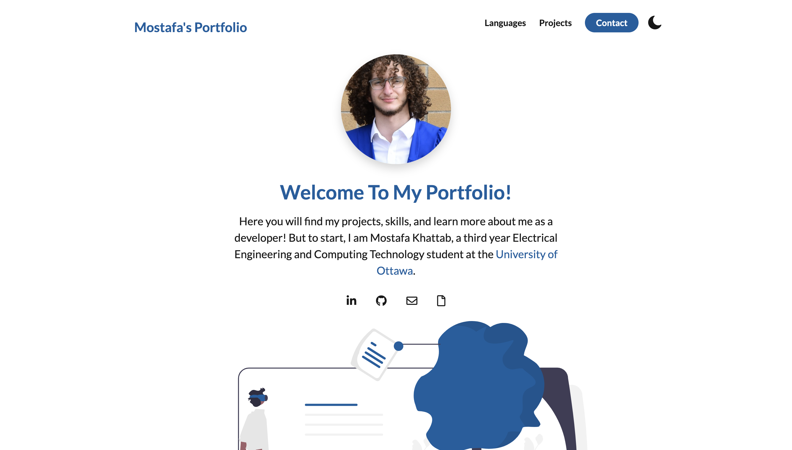

# Personal Portfolio

- A website where I get to tell you more about myself and future as a developer

## Building this Web Application improved my skills on:

- Using HTML and CSS, primarily focusing on: 
    - Sections, links, animations
    - Importing fonts and images
- Ensuring the website is fully responsive
- Creating transitions, layouts and themes
- Using Javascript to toggle light mode and dark mode 
- Depolying this website using Github

## Sections:
- 1. Projects: Where I talk more in depth on what projects I created and how they turned out
- 2. Technologies: I mentioned some programming languages, frameworks and tools I've used
- 3. Footer: Here I provided my contact information
